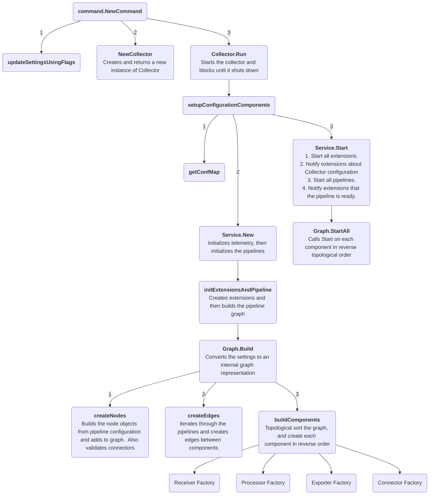

## Internal architecture

* goal
  * Collector internal architecture
  * startup flow

* [opentelemetry.io's architecture end-user](https://opentelemetry.io/docs/collector/architecture/)

### Startup Diagram

### Where to start to read the code

- [collector.go](../otelcol/collector.go)
- [graph.go](../service/internal/graph/graph.go)
- [component.go](../component/component.go)

#### Factories

* `Factory` interface & `NewFactory` function / EACH component
  * `NewFactory`
    * register key functions -- with the -- Collector
      * _Example:_ [receiver.go](../receiver/receiver.go)

* `nextConsumer`
  * == entity | receiver will send its data | its telemetry pipeline
